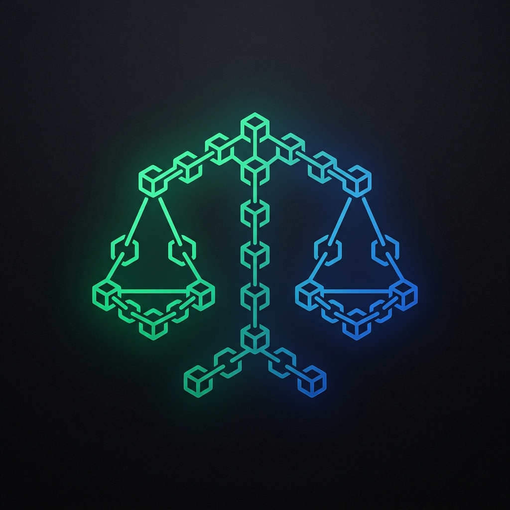

<p align="center">
  
</p>

<h1 align="center">EvidenceChain</h1>

<p align="center">
  <strong>Cryptographic Audit Trail, Merkle Tree Immutability, and Legal-Grade Digital Forensics Ledger for Java &amp; Spring Boot</strong>
</p>

<p align="center">
  <a href="https://github.com/FrodyGr/EvidenceChain/actions/workflows/ci.yml"></a>
  <a href="https://central.sonatype.com/artifact/io.github.frodygr/evidencechain"></a>
  <a href="LICENSE"></a>
  <a href="https://www.oracle.com/java/technologies/downloads/#java21"></a>
  <a href="https://spring.io/projects/spring-boot"></a>
</p>

---

## Overview

In critical regulatory environments (DORA, NIS2, ISO 27001, SOC 2, HIPAA, GDPR), standard application database logs do **not** possess evidentiary validity in court or regulatory inquiries because any database administrator or compromised service account can silently modify historical rows or timestamps.

**EvidenceChain** is a high-performance cryptographic audit ledger designed and certified by a **Perito Informático Colegiado (Certified Judicial Computer Expert Nº 03624)**. It binds business events into an append-only cryptographic chain using binary SHA-256 Merkle trees, delivering mathematical proof of tampering and automated court-admissible forensic certificates.

---

## Forensic Ledger & Verification Demo

### 1. Merkle Tree Ledger Architecture
Every event record is cryptographically linked. Modifying or omitting a single byte in historical storage immediately collapses the SHA-256 Merkle root:

```text
┌─────────────────────────────────────────────────────────────────────────────┐
│                 EvidenceChain SHA-256 Merkle Ledger Tree                    │
└─────────────────────────────────────────────────────────────────────────────┘
                                  [MERKLE ROOT]
                         d9a4f21b7c89...e04218a9 (Block #104)
                                ┌───────┴───────┐
                     [Node H_01]                 [Node H_23]
                    7b12a0...44c1               9f81d4...112e
                    ┌─────┴─────┐               ┌─────┴─────┐
                 [Leaf 0]    [Leaf 1]        [Leaf 2]    [Leaf 3]
                 Tx #101     Tx #102         Tx #103     Tx #104
                WIRE_XFER   KYC_UPDATE      AUTH_ROLE   SIGN_CONTRACT
```

### 2. Legal-Grade Cryptographic Verification Output
Instant mathematical audit of ledger integrity and inclusion proofs:

```text
[EVIDENCE-CHAIN] ⚖️  Cryptographic Audit Verification (104 blocks)
┌─ Ledger State:     VALID (0 discrepancies found across 104 blocks)
├─ Genesis Block:    e3b0c44298fc1c149afbf4c8996fb92427ae41e4649b934ca495991b7852b855
├─ Current Root:     d9a4f21b7c89a0b12e345f6789c0123456789abcdef0123456789abcdef04218
├─ Inclusion Proof:  O(log N) verification (7 hashes evaluated for Tx #104)
└─ Compliance:       Meets DORA Art. 12, ISO 27001 A.12.4 & Judicial Forensic Standards
```

---

## Key Features

* **SHA-256 Merkle Tree Integrity**: Each audit record is cryptographically linked to the preceding event. Changing or deleting a single historical byte immediately invalidates the Merkle Root.
* **$O(\log N)$ Merkle Inclusion Proofs**: Prove that a specific event exists in an audited ledger without disclosing or transmitting the surrounding database contents.
* **Forensic Judicial Certificates**: Generate formal digital chain of custody reports ready for submission in judicial proceedings or regulatory audits.
* **Declarative Spring Boot Integration**: Annotate business methods with `@AuditedEvidence` to capture immutable audit blocks automatically.

---

## Installation

### Core Engine
```xml
<dependency>
    <groupId>io.github.frodygr</groupId>
    <artifactId>evidencechain-core</artifactId>
    <version>0.1.0</version>
</dependency>
```

### Spring Boot 3 Starter
```xml
<dependency>
    <groupId>io.github.frodygr</groupId>
    <artifactId>evidencechain-spring-boot-starter</artifactId>
    <version>0.1.0</version>
</dependency>
```

---

## Quickstart

### Native Java Usage

```java
EvidenceChainLedger ledger = new EvidenceChainLedger();

// 1. Record critical business actions
ledger.record("user-491", "FUNDS_TRANSFERRED", "Account/ES9121...", Map.of("amount", "5000.00", "currency", "EUR"));
ledger.record("officer-10", "KYC_APPROVED", "User/491", Map.of("document", "PASSPORT"));

// 2. Mathematically verify entire ledger
VerificationReport report = ledger.verify();
System.out.println("Ledger Valid: " + report.valid()); // true
System.out.println("Merkle Root:  " + report.computedMerkleRoot());

// 3. Export forensic legal certificate
ForensicReportExporter exporter = new ForensicReportExporter();
String certificate = exporter.generateCertificate(ledger, "CASE-2026-AUDIT-01");
System.out.println(certificate);
```

### Spring Boot 3 Declarative Usage

```java
@Service
public class TreasuryService {

    @AuditedEvidence(action = "WIRE_TRANSFER", resource = "TreasuryVault")
    public void executeWireTransfer(String recipient, double amount) {
        // Business logic runs normally
        // Arguments and timestamp are cryptographically hashed and linked to the ledger!
    }
}
```

---

## Documentation

Comprehensive architecture diagrams, compliance mapping, and API specifications are available in the [Official Wiki](https://github.com/FrodyGr/EvidenceChain/wiki).

---

## License

Licensed under the [Apache License, Version 2.0](LICENSE).  
Architected by **Carlos Expósito (Perito Informático Colegiado Nº 03624)**.
